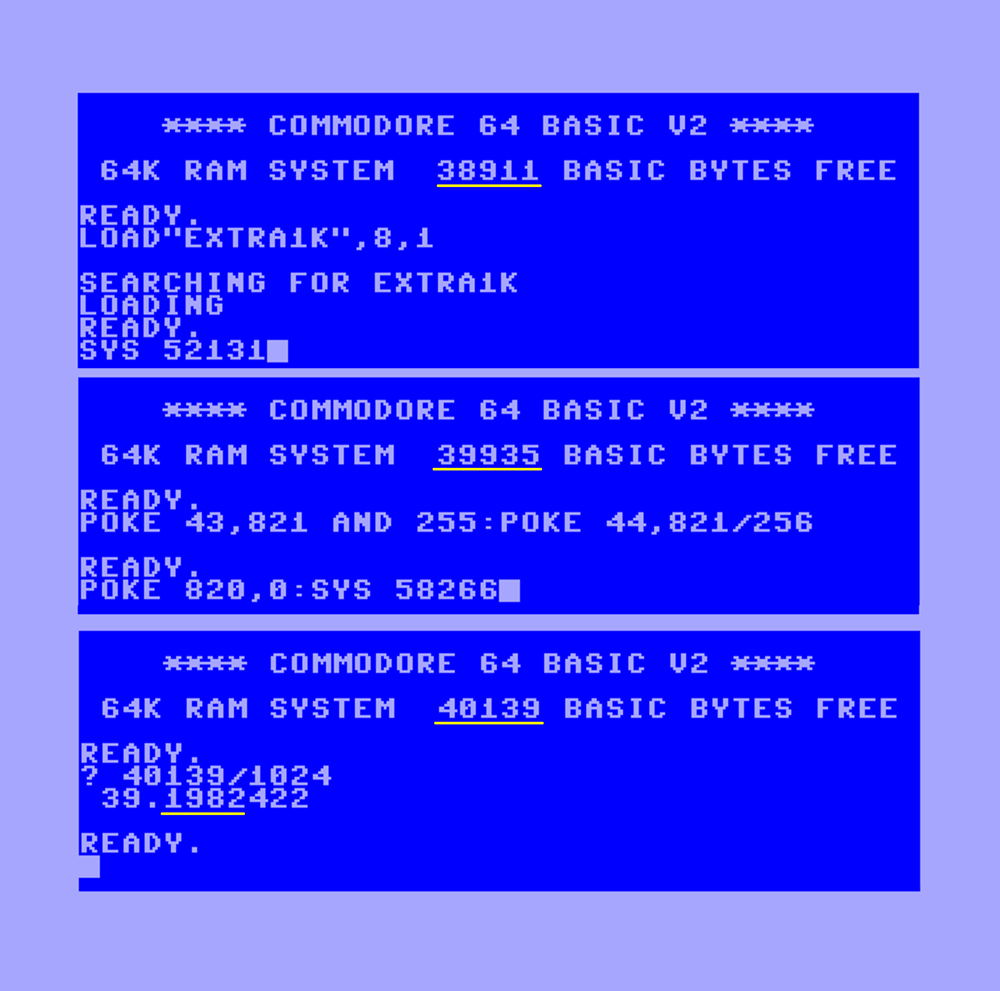

# Extra1K #

BASIC RAM can use extra one kilobyte by moving screen memory to $CC00 (52224).

Instructions:

    LOAD "EXTRA1K.PRG",8,1
    SYS 52131

See use of Jim Butterfield's SCREENMAP64 and discussions of optimal memory layouts:
https://techwithdave.davevw.com/2024/05/c64-ram-locations-for-programmable.html